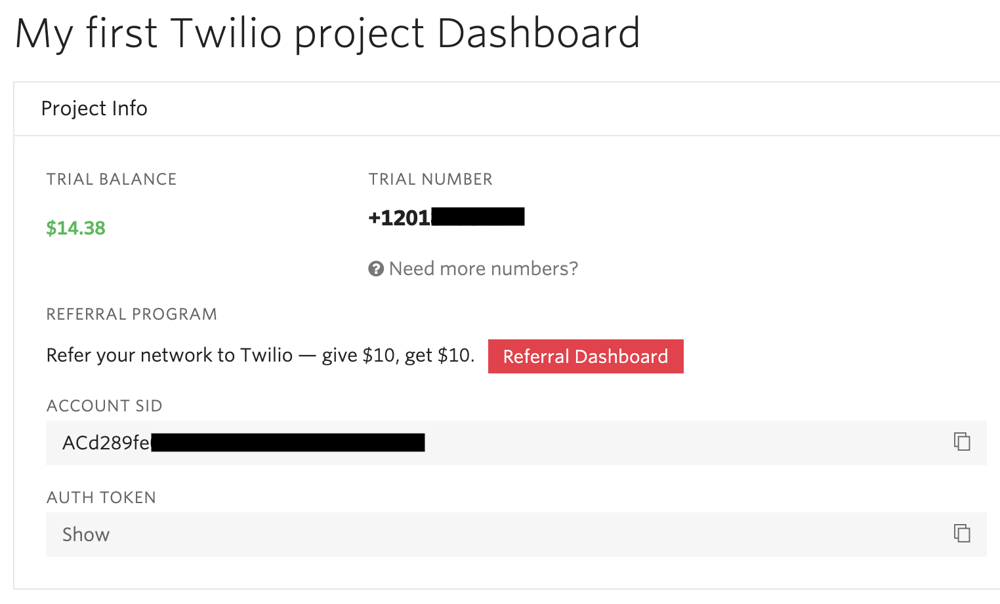
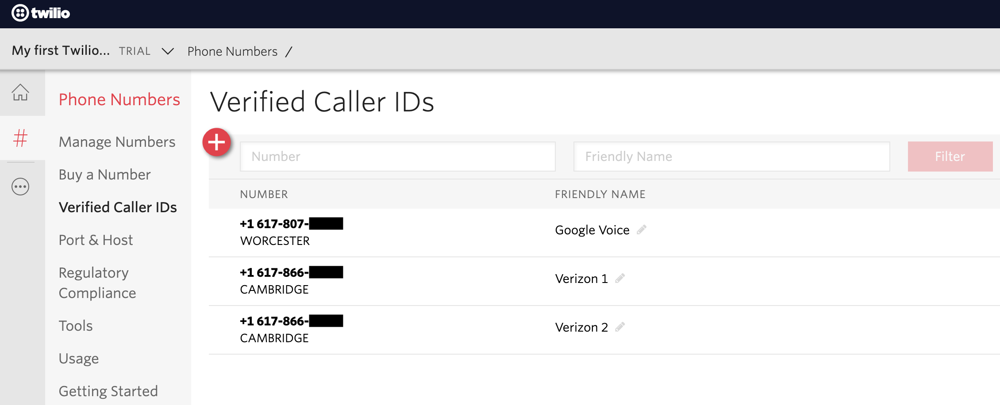

# Twilio phone call

## Description

*This field plug-in is part of a series of tools for working with Twilio in SurveyCTO. To learn more, check out our support article on [using Twilio with SurveyCTO to securely record phone calls only with consent](https://support.surveycto.com/hc/en-us/articles/360055415333)*.

This plug-in allows for forms to launch outbound calls via Twilio.  

The twilio-call field plug-in can be use when collecting data using [computer-assisted telephone interviewing (CATI)](https://support.surveycto.com/hc/en-us/articles/360044958494).

*If you're interested in piloting Twilio for CATI applications, please reach out to support@surveycto.com.*

## Features

 * Supports displaying or hiding the number being dialed.
 * Supports audio recording within Twilio.
 * Supports at-rest encryption of call recordings using SurveyCTO-generated encryption keys.

See [this blog post]([https://www.surveycto.com/blog/twilio-plug-in/](https://www.surveycto.com/blog/twilio-plug-in/)) for more benefits.

## Data format
This field plug-in supports the _text_ field type, and the data is stored in the field in a pipe-separated ("|") list. For example:
	
	completed|call_id_123|https://api.twilio.com/2010-04-01/Accounts/account_id_123/Calls/call_id_123.json|https://api.twilio.com/2010-04-01/Accounts/account_id_123/Calls/call_id_123/Recordings.json

Retrieve the following items from this list using the [item-at()](https://docs.surveycto.com/02-designing-forms/01-core-concepts/09.expressions.html#Help_Forms_item-at) form function at these positions in the list:

* 0 - The call status. e.g. "queued", "ringing", and "complete".
* 1 - The [string identifier (SID)](https://www.twilio.com/docs/glossary/what-is-a-sid) for the call.
* 2 - Twilio URL to the record of the call.
* 3 - Twilio URL to the recording of the call (if enabled).

## How to use

*If you would like more detailed steps, including on how to set up a Twilio account and phone number, check out [this guide](extras/detailed_steps.md). If you run into an error, check out our [troubleshooting guide](extras/troubleshooting.md).*

* Download the [sample form](https://github.com/surveycto/twilio-call/blob/master/extras/sample-form/Sample%20form%20-%20Twilio%20call%20field%20plug-in.xlsx?raw=true).
 * Download the [field plug-in](https://github.com/surveycto/twilio-call/blob/master/twilio-call.fieldplugin.zip?raw=true).
 * Edit that sample to change the two references to "+1" to be a plus followed by your current country code.
 * Download the [twilio_access.csv](https://github.com/surveycto/twilio-call/raw/master/extras/sample-form/twilio_access.csv) dataset template (right-click the link, click *Save link as*, set format to *All Files*, add `.csv` to the file name, and save).
 * Edit that .csv template to add your Twilio `Account SID` and `Auth Token`, as well as one of your Twilio numbers into the *1234* row.
 * Upload the sample form to your SurveyCTO server, attaching both the plug-in package and the .csv file. Alternatively, upload the .csv into a dataset and attach that dataset (learn more about [pre-loading](https://docs.surveycto.com/02-designing-forms/03-advanced-topics/03.preloading.html)).
 
If you're new to Twilio, your free trial's home screen should include your trial Twilio number as well as your `Account SID` and `Auth Token`:

**Important:** please note that with a free Twilio trial account, you can only call to numbers that have been verified as belonging to you. So if you're using a trial account, be sure to [verify all numbers](https://www.twilio.com/docs/usage/tutorials/how-to-use-your-free-trial-account#verify-your-personal-phone-number) you want to test with before trying to call them. This includes the number you will call from. If you do not verify both the `from_number` and `to_number`, you will get a status 400 error when trying to make a call.

When you use the plug-in, it will dial your number first (`from_number`), then dial the number you're trying to call (`to_number`). If you're using a free trial account, there will be a brief message from Twilio before the second number is dialed.

The plug-in allows just one dial attempt per field, so the sample form uses a [repeat group]([https://docs.surveycto.com/02-designing-forms/01-core-concepts/06.groups.html](https://docs.surveycto.com/02-designing-forms/01-core-concepts/06.groups.html)) to support multiple dial attempts. For each, the field itself records, in the field's response data, call status, unique Twilio call SID, Twilio details API URL, and Twilio recordings API URL in a pipe-separated ("|") list (use [item-at()](https://docs.surveycto.com/02-designing-forms/01-core-concepts/09.expressions.html#Help_Forms_item-at) to access each item). The full API response from Twilio is available in the field's metadata.

When a dial attempt is first made, the saved status will always be `queued`, which means that the dial attempt has been issued within Twilio. The user can click the `Update status` button to request updated status from Twilio, in which case the field's response value and metadata will be updated with the latest status.

## Parameters

The plug-in requires that you specify values for each of the following parameters: 

| Key | Value |
| --- | --- |
| `from_number` (required)| This is the phone number of the caller (generally the enumerator), starting with a country code (like *+1* for U.S. numbers). The dialer will dial this number first.|
| `to_number` (required)| This is the phone number to dial (generally the respondent), starting with a country code (like *+1* for U.S. numbers). The dialer will dial this number second, connecting it to the first.|
| `twilio_number` (required)| This is the Twilio number that will be used as the caller ID for both phone calls. Note that Twilio only allows one call per second from a given Twilio number, so if you have many enumerators making calls at the same time you may need to use multiple Twilio numbers.|
| `accountSID` (required)| This is your Twilio Account SID.|
| `auth_token` (required)| This is your Twilio Auth Token.|
| `record` (optional)| This should be equal to 1 to record the phone call within Twilio or 0 to not record the call. If the call is recorded, it will be recorded with Twilio's dual-channel support so that each side of the conversation can be isolated during analysis. The default is to record calls (`record = 1`)|
| `display_number` (optional)| This should be equal to 1 to show the `to_number` in the form's user interface or 0 to hide the number. The default is to show the number (`display_number = 1`)|

## More resources

* **Sample form**  
You can find a form definition in this repo here: [extras/sample_form](https://github.com/surveycto/twilio-call/blob/master/extras/sample-form/Sample%20form%20-%20Twilio%20call%20field%20plug-in.xlsx?raw=true).
* **Developer documentation**  
Instructions and resources for developing your own field plug-ins.  
[https://github.com/surveycto/Field-plug-in-resources](https://github.com/surveycto/Field-plug-in-resources)
* **User documentation**  
How to get started using field plug-ins in your SurveyCTO form.  
[https://docs.surveycto.com/02-designing-forms/03-advanced-topics/06.using-field-plug-ins.html](https://docs.surveycto.com/02-designing-forms/03-advanced-topics/06.using-field-plug-ins.html)
* **SurveyCTO computer-assisted telephone interviewing (CATI) starter kit**  
[https://support.surveycto.com/hc/en-us/articles/360044958494](https://support.surveycto.com/hc/en-us/articles/360044958494)
