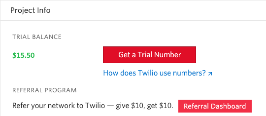
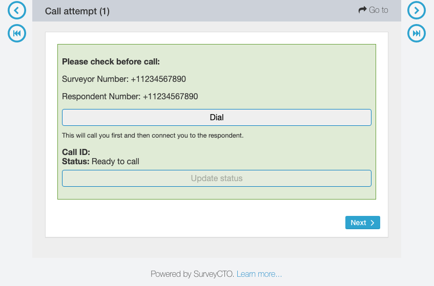

# Detailed step guide to the twilio-call field plug-in

If you are brand new to Twilio, you can follow these steps to help get you set up. These steps go into deep detail on exactly what to do (which is why there are so many steps), so if you already have experience with CSV files and web applications, you may not need them, and the standard [readme](../README.md) should be enough. However, feel free to come back here at any time if you are running into trouble.

These steps were written in December 2020, but updates to Twilio may cause slight changes.

## Create Twilio account

1. Go to the [Twilio homepage](https://www.twilio.com/).
1. In the upper-right, click *Sign up*.
1. Complete the form, and sign up for the free trial.
1. Open the confirmation email you have received, and click the link to *Confirm Your Email*.
1. In the link that opens, enter a phone number you can for verifying your account. It will send an SMS text message to that phone number, but you will also get the option to verify via a phone call.
1. Answer the questions when prompted, or you can click *Skip to dashboard* on the lower-right.

## Set up Twilio

### Get a Trial Number

1. On your [Twilio console](https://www.twilio.com/console), click *Get a Trial Number*.

2. Decide on the phone number you would like to use, and click *Choose this Number*. (This cannot be changed under a trial account, but with a paid Twilio account, you can purchase additional phone numbers.)
1. When the phone number has been added, click *Done* in the lower-right of the popup. The page will then refresh.

### Set up and verify phone number

On a trial account, you can only make calls to and call from verified phone numbers. You will need to verify each phone number you would like to use for testing. If you are already on a paid Twilio account (not on a free trial), you can skip these steps. The phone number you entered earlier when creating your account will already be verified. When testing, it is okay to make the phone number you are calling from and the phone number you are calling the same phone number (we'll explain more later), so for now, it is okay if you have only verified one phone number.

To learn how to add additional phone numbers, check out [this Twilio support article](https://support.twilio.com/hc/en-us/articles/223180048-Adding-a-Verified-Phone-Number-or-Caller-ID-with-Twilio).

## Set up SurveyCTO form

### Set up the CSV file

1. Download the [sample form](https://github.com/surveycto/twilio-call/blob/master/extras/sample-form/Sample%20form%20-%20Twilio%20call%20field%20plug-in.xlsx?raw=true) and the [field plug-in](https://github.com/surveycto/twilio-call/blob/master/twilio-call.fieldplugin.zip?raw=true).
1. Download the CSV file. To do so, right-click [this link](https://github.com/surveycto/twilio-call/raw/master/extras/sample-form/twilio_access.csv), click *Save Link As*, set format to *All Files*, add `.csv` to the file name, and save the file.
1. Open the CSV file you just saved. Set it aside for now, but we will need it soon.
1. Return to your [Twilio console](https://www.twilio.com/console).
1. Under *ACCOUNT SID*, copy the code there (it will start with "AC").
1. In the CSV file, replace `YOUR_SID_HERE` (under 'sid') with the account SID you copied.
1. Back on the Twilio console, copy the *AUTH TOKEN*. (Note: Do not share this auth token, since it can be used to access saved recordings, as well as other information about your Twilio account).
1. In the CSV file, replace `YOUR_AUTH_TOKEN_HERE` (under 'authtoken') with the auth token you copied.
1. Back on the Twilio console, under *TRIAL NUMBER*, copy the phone number there, including the plus *+*.
1. In the CSV file, replace `YOUR_TWILIO_NUMBER_HERE` (under 'number') with the phone number you copied.
1. Save the CSV file.

### Upload the files

Once the CSV file is ready, upload them to your SurveyCTO server console as a new, deployed form with the XLSX form as the form file, and the field plug-in and CSV file as form attachments. To learn more, check out our [guide to field plug-ins](https://support.surveycto.com/hc/en-us/articles/360045234534), section *3. Getting started with a plug-in*.

## Use the form

When you make a call using Twilio, your trial number will first call your phone number, and then soon after you pick up, it will call the phone number you would like to dial. For testing purposes, it is okay if these are the same phone number; the same phone will be called twice.

When under a trial account, both the phone number you are calling from and the phone number you are calling to will have to be verified ([see above](#set-up-and-verify-your-phone-numbers)). If you would like call phone numbers that have not been verified, you will have to [upgrade to a paid Twilio plan](https://support.twilio.com/hc/en-us/articles/223183208-Upgrading-to-a-paid-Twilio-Account).

You can follow these steps either using [SurveyCTO Collect](https://docs.surveycto.com/03-collecting-data/01-mobile-data-collection/01.mobile-collect.html), [web forms](https://docs.surveycto.com/03-collecting-data/02-web-data-collection/01.web-forms.html), or the [test view](https://docs.surveycto.com/02-designing-forms/01-core-concepts/02c.testing-forms.html).

1. Open the form.
1. For *Number to dial*, enter the phone number you would like to call.
1. For *Your number*, enter your own phone number.
1. Select whether you would like to record the call, and whether the phone number will be displayed (in your actual form, these will likely be programmed into the form instead of chosen by the enumerator, but this is good for testing).
1. At the popup asking to add a group, click *Add group*.
1. You will then get to the actual field plug-in. Click the *Dial* button. Tip: You can click the *Update status* button at any time to view the current status of the call. If there is an error, check out the [troubleshooting guide](troubleshooting.md).

7. The phone number entered for *Your number* will be called from your Twilio phone number. Answer that call.
1. You will get a message about how you are using a trial account. Wait for the message to end, then use the phone keypad to press any key. If you press any key before the message ends, the call will end without calling the other number. If you wait too long before pressing a key on the keypad, this will also cause the call to end without calling the other number. So, make sure you press a key on the keypad within a few seconds of the message ending. This will not be a concern if you upgrade to a paid Twilio account.
1. The phone number entered for *Number to dial* will be called from your Twilio phone number. Answer that call. (That phone will not require pressing a key on the keypad to continue.)
1. There will now be a connected call between those two phone numbers (or, if the *Your number* and *Number to dial* are the same, there will be two active calls on that phone to the same phone number). You can try talking (for testing recording), and then hang up when you are done.

## Further reading

To learn more about recording calls using Twilio, check out our support article on [Using Twilio with SurveyCTO to securely record phone calls only with consent](https://support.surveycto.com/hc/en-us/articles/360055415333).